# Poker Tournament Tracker — Features

## Core Features

### Tournament Scheduling
- Individual and bulk tournament entry
- Tournament templates
- CSV/Excel import with custom mapping
- Registration planning and conflict detection
- Calendar/timeline visualization

### Active Session Management
- Real-time dashboard for active tournaments
- Quick update interface (hover, one-click, batch)
- Multi-platform optimization (desktop/tablet/mobile)
- Notification system (reminders, alerts, snooze)

### Bankroll Tracking
- Transaction management (deposit, withdrawal, bonus, tax, fee, transfer, adjustment)
- Multi-site and multi-currency support
- Running balance and historical charts
- Tax management (TDS/manual, reporting)

### Analysis Tools
- Performance metrics (ROI, ITM%, profit/loss, etc.)
- Time-based and format-based analysis
- Custom reports with export options

### Data Management
- IndexedDB offline-first storage
- Firebase/Firestore cloud backup
- Import/export (multiple formats, Google Sheets)
- Version history and data validation

## Non-Functional Features
- Responsive, adaptive PWA (desktop/tablet/mobile)
- Security (local encryption, authentication)
- Reliability (integrity checks, crash recovery, backups)
- Maintainability (minimal dependencies, self-healing, documentation)

---

## Feature Map

```mermaid
graph TD
  A[Tournament Scheduling]
  B[Active Session Management]
  C[Bankroll Tracking]
  D[Analysis Tools]
  E[Data Management]
  F[Non-Functional]

  A --> A1(Individual/Bulk Entry)
  A --> A2(Templates/Import)
  A --> A3(Registration Planning)
  A --> A4(Calendar View)

  B --> B1(Real-time Dashboard)
  B --> B2(Quick Updates)
  B --> B3(Notifications)
  B --> B4(Multi-platform)

  C --> C1(Transaction Management)
  C --> C2(Multi-site/Currency)
  C --> C3(Tax Management)
  C --> C4(Balance Charts)

  D --> D1(Performance Metrics)
  D --> D2(Time/Format Analysis)
  D --> D3(Custom Reports)

  E --> E1(IndexedDB Offline)
  E --> E2(Firebase Backup)
  E --> E3(Import/Export)
  E --> E4(Version History)

  F --> F1(Security)
  F --> F2(Reliability)
  F --> F3(Maintainability)
```

